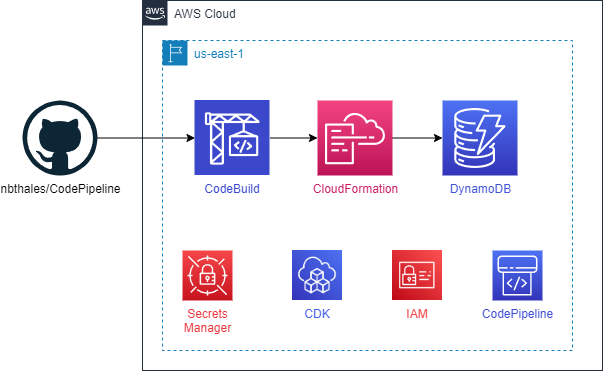
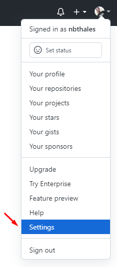
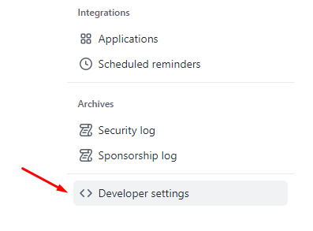
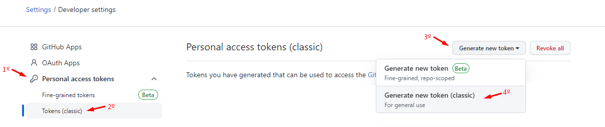
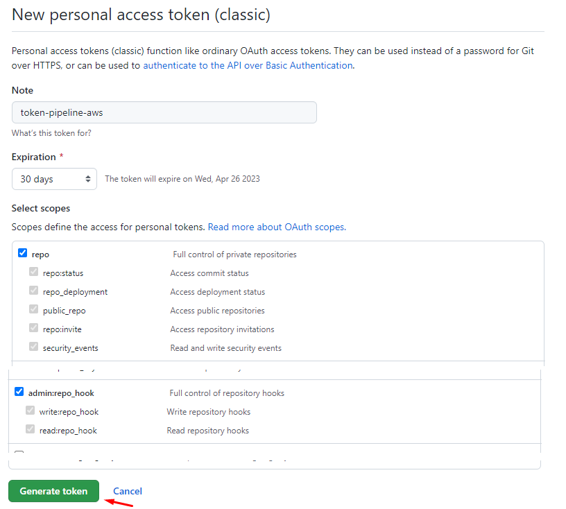
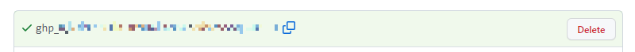
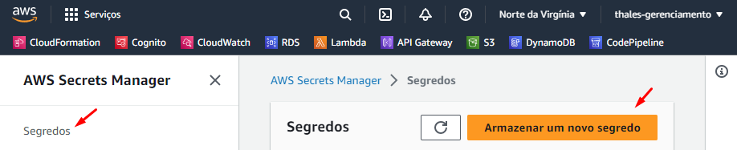
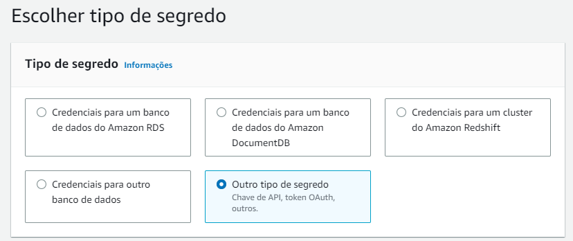
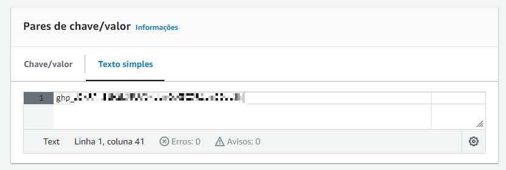

# CodePipeline - AWS CDK TypeScript

Esse projeto tem o objetivo de construir e manter a infraestrutura dos recursos AWS.

## Diagrama da Arquitetura

## Comandos úteis

- `aws configure` configurações que a AWS Command Line Interface (AWS CLI) usa para interagir com a AWS
- `npm install` instalação de pacotes, gerenciamento da versões e gerenciamento de dependências necessárias
- `cdk bootstrap --trust 670951049310 --cloudformation-execution-policies arn:aws:iam::aws:policy/AdministratorAccess aws://869397599638/us-east-1` permitindo acesso de uma conta à outra para provisionar pilha de bootstrap no ambiente da AWS usando um template moderno

## Apresentação

- [Google Drive](https://docs.google.com/presentation/d/1GraoJJ0YqJEDcV727Tz2rkd0Kk5_1wuXmod9RLrfvK0/edit?usp=sharing)

## Configuração

### Gerar token no GitHub que será utilizado pela AWS ter direito de acesso ao repositório.

Profile > Settings

> Developer settings

> Personal access tokens > Tokens (classic) > Generate new token

> Crie o token preenchendo o campo do nome, expiração e selecione 2 escopos: "admin:repo_hook" e "repo".

> Guarde o segredo gerado conforme abaixo, ele sera guardado na AWS.

### Guardando o segredo gerado do GitHub na AWS.

Abra o serviço Secrets Manager da conta de gerenciamento da AWS. 
AWS Secrets Manager > Segredos > Armazenar um novo segredo

Tipo de segredo > Outro tipo de segredo

Pares de chave/valor > Texto Simples > Colar o segredo gerado do GitHub

Próximo > Nome do Segredo: github-token > Próximo > Armazenar
